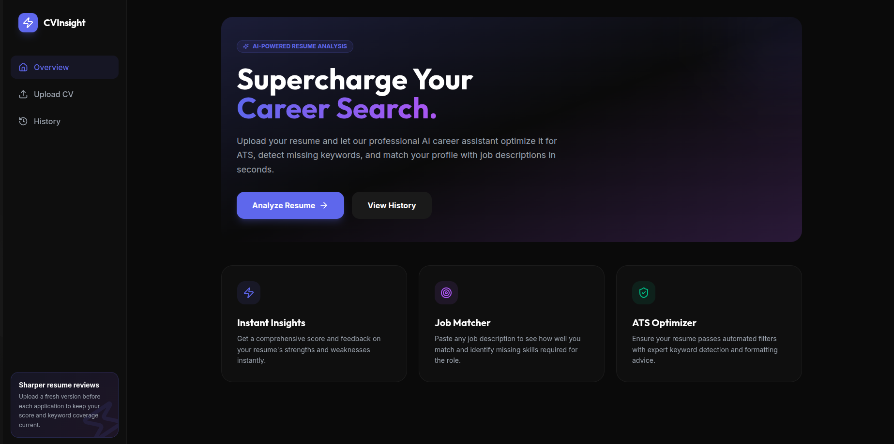
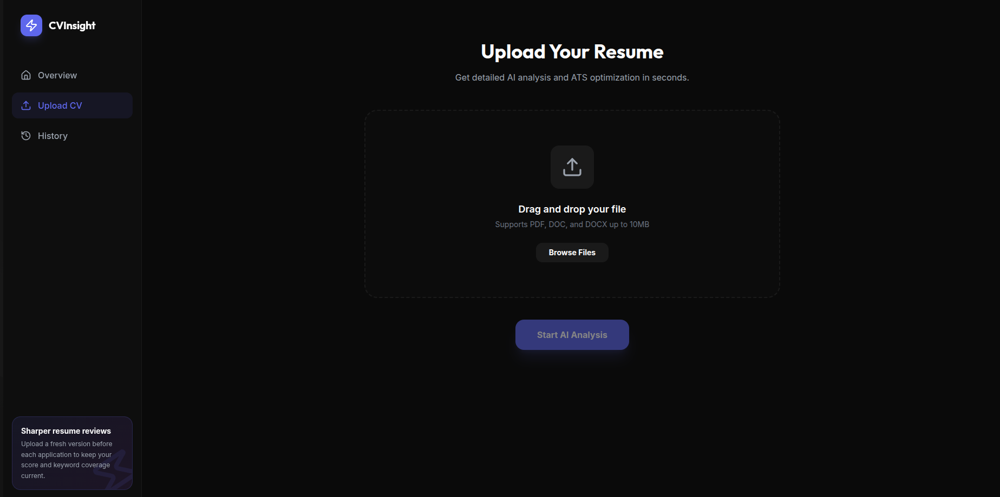
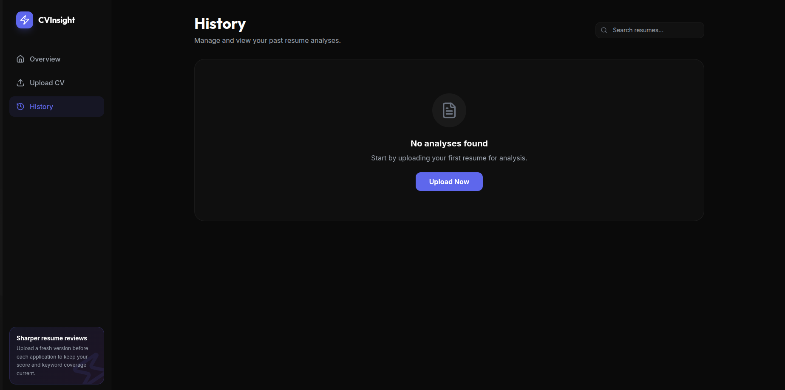
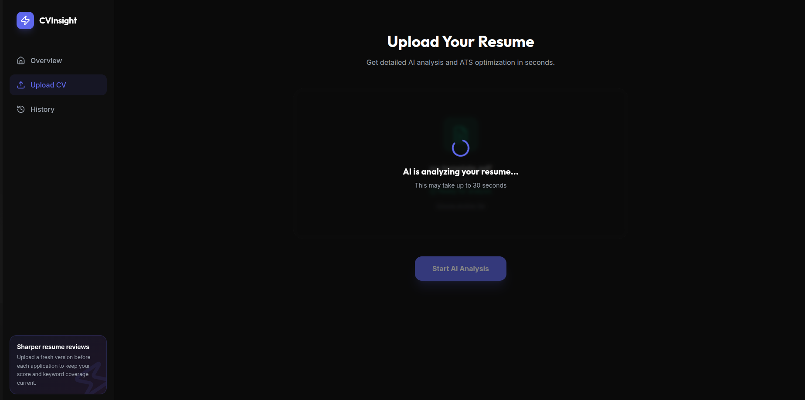
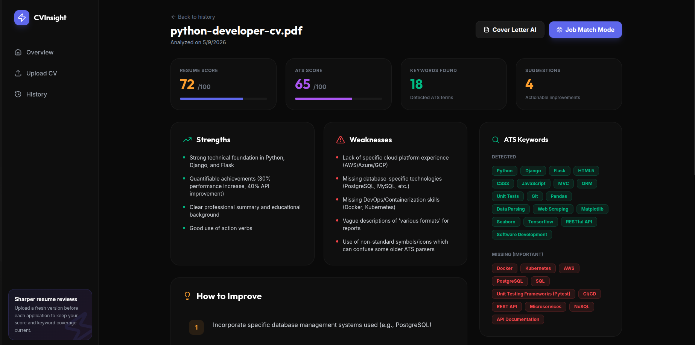
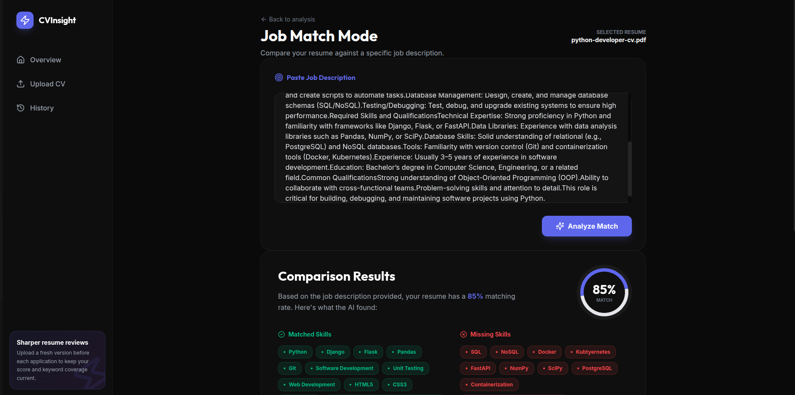

# CVInsight — AI Resume & ATS Optimization Platform

[](https://fastapi.tiangolo.com/)
[](https://vuejs.org/)
[](https://tailwindcss.com/)
[](https://ollama.ai/)

**CVInsight** is a high-performance, AI-driven career assistant designed to bridge the gap between candidates and Applicant Tracking Systems (ATS). By leveraging state-of-the-art LLMs, CVInsight provides deep structural analysis, keyword optimization, and real-time job description matching.



---

## 🌟 Key Features

### 📤 Seamless File Uploads

- **Fast Processing**: Drag & drop your CV for instant parsing.

### 📄 Intelligent Resume Analysis

- **Deep Scanning**: Supports PDF and DOCX formats with high-fidelity text extraction.
- **Dual Scoring**: Provides an **Overall Quality Score** and a specialized **ATS Compatibility Score**.
- **SWOT Analysis**: Automatically identifies **Strengths**, **Weaknesses**, and **Actionable Opportunities**.

### 🎯 Job Match Mode (Precision Targeting)

- **Gap Analysis**: Paste any job description to see an instant match percentage.
- **Skill Mapping**: Visualizes matched vs. missing skills required for the specific role.
- **Tailoring Advice**: Get AI-generated advice on how to rewrite sections to fit the job.

### 🔑 ATS Optimization & Cover Letters

- **Keyword Detection**: Scans for industry-standard terminology expected by recruiters.
- **Formatting Tips**: Identify common formatting pitfalls that cause ATS rejection.
- **Professional Rewrite**: Instantly generate a high-impact executive summary.

### 📊 Professional Dashboard & History

- **History Tracking**: Keep a secure record of all past resume versions and analyses.
- **Premium UI**: Sleek, dark-themed interface built with glassmorphism and modern typography.

---

## 🛠️ Architecture & Tech Stack

### Backend (`cvinsight_api`)
- **FastAPI**: Asynchronous Python web framework for high-concurrency performance.
- **SQLAlchemy + SQLite**: Robust data persistence for analysis history.
- **PyMuPDF & python-docx**: Industrial-grade document parsing.
- **Ollama / OpenAI**: Flexible AI provider support (Local-first by default).

### Frontend (`cvinsight_web`)
- **Vue 3 (Composition API)**: Reactive and performant frontend architecture.
- **Vite**: Ultra-fast build tool and development server.
- **Tailwind CSS**: Premium design system with custom glassmorphism components.
- **Pinia**: Centralized state management for seamless navigation.

---

## 🚦 Getting Started

### Prerequisites
- **Python 3.10+**
- **Node.js 18+**
- **Ollama** (Recommended for local AI)

### 1. Backend Setup (using uv)
```bash
cd cvinsight_api
uv sync
cp .env.example .env
# Set your AI_PROVIDER in .env (default: ollama)
uv run uvicorn app.main:app --reload
```

### 2. Frontend Setup
```bash
cd cvinsight_web
npm install
npm run dev
```

---

## 🧠 AI Configuration

CVInsight is built to be **Privacy-First**. By default, it uses **Ollama** to run models locally on your hardware.

### Using Ollama (Local)
1. Install Ollama from [ollama.ai](https://ollama.ai).
2. Pull the default model:
   ```bash
   ollama pull llama3.2
   ```
3. Ensure Ollama is running before starting the API.

### Using OpenAI (Cloud)
If you prefer cloud-based analysis:
1. Update `AI_PROVIDER=openai` in `cvinsight_api/.env`.
2. Add your `OPENAI_API_KEY`.
3. Set `OPENAI_MODEL=gpt-4o-mini` (or your preferred model).

---

## 📁 Project Structure

```text
cvinsight_project/
├── cvinsight_api/          # FastAPI Backend
│   ├── app/
│   │   ├── api/            # API Endpoints
│   │   ├── models/         # Database Models
│   │   ├── services/       # AI & Parsing Logic
│   │   └── main.py         # App Entry
│   └── pyproject.toml      # uv Dependencies
└── cvinsight_web/          # Vue 3 Frontend
    ├── src/
    │   ├── views/          # Dashboard & Analytics Pages
    │   ├── components/     # UI Components
    │   └── main.js         # Vue Setup
    └── tailwind.config.js  # Premium Styling
```

---

## 📜 License
Distributed under the MIT License. See `LICENSE` for more information.

---
**CVInsight** — Empowering your career journey with artificial intelligence.
